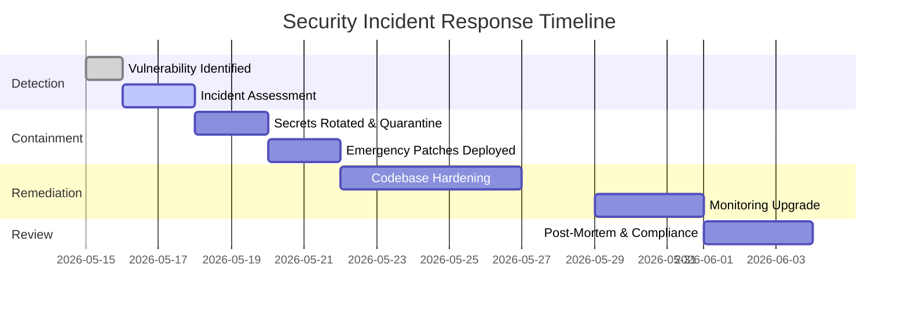
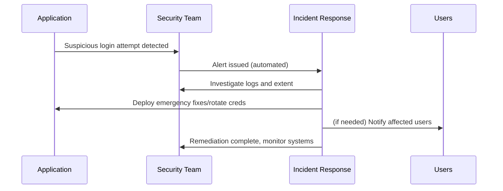

# Executive Summary  
The audit uncovered **critical secrets** and architectural flaws in AIMS. Plaintext credentials and placeholder secrets in code/config (CRIT-01/02) must be purged and replaced with strong, managed secrets【6†L68-L77】. Temporary passwords and recovery tokens are mishandled (CRIT-03/07): they should never be stored or transmitted in plaintext. Key protections like rate-limiting, CSRF tokens, and middleware-based authentication are missing (CRIT-04/05/06), enabling brute-force, CSRF, and unprotected API access. Reflected XSS (CRIT-03) and unsafe CORS/File-uploads (HIGH, LOW findings) expose the app to injection and malware. HR-level roles are over-privileged (HIGH-07), and UX flows leak information (HIGH-01/03). 

**Recommended actions:** Immediately **rotate all exposed secrets** and **git-purge** them from history. Introduce a **robust ID generation and onboarding flow**: generate temporary passwords server-side, display them exactly once (no API echo), and force users to change on first login. Implement **NextAuth middleware or `getServerSession()`** on *all* `/api/*` routes to enforce authentication【40†L1-L4】. Add **rate-limiting** (e.g. `express-rate-limit`) on sensitive endpoints【23†L1-L4】 and **account lockouts** to prevent brute-force. Apply **CSRF tokens** on all state-changing requests with SameSite=Strict cookies【37†L289-L297】. Sanitize all user input to eliminate XSS (e.g. encode any user text in responses or use strict Content Security Policy). Secure file uploads by **whitelisting extensions**, validating file content (magic-bytes)【32†L197-L201】, storing uploads privately (or using signed URLs), and scanning with antivirus/sandbox【32†L207-L209】.  

Below is a prioritized vulnerability list (A), an implementation plan (B), a developer prompt with code snippets (C), and advanced hardening recommendations (D) to meet enterprise-grade security.  

## A. Findings & Remediations (by Severity)  

### 🔴 Critical Issues  

- **CRIT-01 – Plaintext Credentials in Repo:** Developers accidentally committed founder/HR passwords (e.g. `KarannFuture$136`) and recovery keys in `credentials.txt`. **Fix:** Consider all exposed secrets compromised. **Rotate** every seeded password and recovery key immediately. **Purge** the files from Git history (using `git filter-branch` or BFG)【6†L68-L77】. Move all secrets into a secure store (e.g. encrypted Vercel env vars or HashiCorp Vault)【6†L68-L77】. **Rollback Strategy:** Keep backups of old credentials (secured) and have a dev/test copy of the code without cleanup. **Test:** Verify no plaintext secrets remain: `git log --all -- credentials.txt` should yield nothing.  

- **CRIT-02 – Weak Auth Secrets:** The `.env` contains literal placeholders (`AUTH_SECRET="replace-with-a-strong-random-secret"`) used for JWT/NextAuth signing. **Risk:** Attackers can forge session tokens. **Fix:** Generate high-entropy secrets (e.g. `openssl rand -hex 64`) and update `AUTH_SECRET`/`NEXTAUTH_SECRET`. Store them outside code. Use a secret manager so they aren’t in source control【6†L68-L77】. **Validation:** Verify new random secret values; attempt forging a JWT should fail.  

- **CRIT-03 – Plaintext Temp Passwords in DB:** The system stores unhashed temporary passwords in the database (`User.tempPassword`, `password_reset_requests.tempPassword`) and even returns them in API responses (see HIGH-01). **Risk:** Equivalent to storing real passwords in plaintext – full compromise if leaked. **Fix:** **Never store raw temp passwords.** Generate them server-side, hash immediately, and store only the hash (or drop `tempPassword` column entirely). Only display the plaintext temp password **once** to the user/admin via a non-cacheable UI or e-mail, then discard. Remove `tempPassword` fields via a Prisma migration. Force “change password on first login” behavior. **Test:** Confirm `SELECT tempPassword FROM "User"` returns no rows; attempt login with old temp password must fail; ensure reset flow still works with hashed tokens.  

- **CRIT-04 – No Rate Limiting on Auth:** All `/api/auth/*` endpoints allow unlimited attempts. **Risk:** Brute-force attacker can try thousands of passwords or recovery keys (CRIT-07) per minute. **Fix:** Add throttling middleware (e.g. [express-rate-limit](https://www.npmjs.com/package/express-rate-limit)). For example, limit login attempts to **5 per 15 minutes** per IP and lock account after ~10 failures【23†L1-L4】. Limit password reset attempts similarly (e.g. 3/hour per user/email). Log and alert on brute patterns. **Test:** Simulate repeated failed logins and password resets – after the threshold, new attempts should be rejected (HTTP 429 or 403).  

- **CRIT-05 – Missing CSRF Protection:** State-changing POST/PUT/DELETE routes accept cookies without CSRF tokens. **Risk:** Malicious sites can perform actions as logged-in users (admin could be tricked into creating accounts, deleting users, etc.). **Fix:** Implement a CSRF token on all forms/requests (synchronizer token or double-submit cookie). If using NextAuth (which has some built-in CSRF for credential logins), explicitly enable and verify CSRF tokens on custom APIs【37†L289-L297】. For example, include a hidden `csrfToken` in React forms or use `SameSite=Strict` on cookies【37†L300-L304】. Reject any state-changing request missing a valid token. **Test:** Issue a cross-origin POST (e.g. from a dummy HTML form on another domain) to a protected endpoint – it should be denied with 403.  

- **CRIT-06 – Unprotected API Middleware:** The Next.js middleware matcher currently excludes **all** `/api/*` routes. In other words, *no* API request goes through the session check. **Risk:** Any route can be called anonymously, easily bypassing intended auth checks. **Fix:** Tighten the matcher. Remove the broad `!api` exception so that middleware (e.g. NextAuth’s withAuth) applies to all `/api/*` by default. Alternatively, explicitly protect each route by calling `getServerSession()` or `getToken()` and returning 401 if not signed in【40†L1-L4】. A common pattern is:  
  ```js
  export default async function handler(req, res) {
    const session = await getServerSession(req, res, authOptions);
    if (!session) return res.status(401).json({ error: "Not authenticated" });
    // ...actual handler logic...
  }
  ```  
  **Test:** Try calling a secured API (e.g. `/api/permissions`) without a session; it should now return 401 before any handler logic runs.  

- **CRIT-07 – Weak Founder Recovery Key:** The `FOUNDER_RECOVERY_KEY` is a hardcoded, simple string (`aims-founder-rescue-key-2026`) with no hashing or expiry. **Risk:** Anyone who guesses this (or steals `.env`) can instantly generate a temp password and take over the founder account. **Fix:** Replace it with a cryptographically random key (e.g. `openssl rand -base64 48`). **Hash** the key in storage (compare via bcrypt or HMAC) rather than comparing plaintext. **Add controls:** require rate-limiting (max ~3 attempts/day), notify the founder by email/SMS whenever recovery is used, and require a 2FA second factor (e.g. send a one-time OTP to the founder’s email or phone) before revealing a new password. **Test:** After rotating, attempt recovery with the old key should fail. Verify that abuse (multiple attempts) is limited and logged.  

### 🟠 High Issues  

- **HIGH-01 – Temp Passwords in API Responses:** Various signup/onboarding routes currently return the plaintext temporary password in the JSON response (and render it in the UI). **Risk:** Sensitive credentials transit in responses and may be cached or seen by shoulder-surfers. **Fix:** **Never include passwords in API responses.** Instead, for self-signup send the temp password via email (or display it only once in a non-cacheable dialog with “Copy” button). For admin-created accounts, generate the password server-side and display it immediately, then clear it. Add response headers on any residual pages handling passwords: `Cache-Control: no-store, must-revalidate` and `X-Content-Type-Options: nosniff`【48†L24-L28】【61†L381-L389】 to prevent caching or MIME sniffing. **Test:** Verify that after signup, no JSON or headers contain the password, and browser history/back does not reveal it.  

- **HIGH-02 – No Password Complexity:** The `change-password` endpoint only checks minimum length. **Risk:** Users can set trivial passwords (`password123` etc.) that are easily brute-forced. **Fix:** Enforce a stronger policy: e.g. minimum **10 characters**, at least one uppercase, one lowercase, one digit, and one special character. Optionally check against a common-password blocklist (10k most common). Enforce the same policy on admin- or HR-created passwords (HIGH-05 below). **Test:** Attempts to set “weakpass” or “12345678” should be rejected with an error; ensure legitimate passwords (e.g. `Secur3!ty`) are accepted.  

- **HIGH-03 – User Enumeration:** The forgot-password and signup flows reveal whether an email/user exists (“no account found” vs “email already registered”). There’s also an open `check-username` API. **Risk:** Attackers can harvest valid usernames/emails. **Fix:** Return generic messages that don’t confirm existence (e.g. *“If an account with that email exists, you will receive an email.”*). Disable or protect the `check-username` endpoint (require authentication or heavy rate-limit with CAPTCHA). Ensure both success/failure paths take the same amount of time to prevent timing attacks. **Test:** Submit the “forgot password” form with an unknown email – the response (or redirect) should be identical to a known email.  

- **HIGH-04 – Missing `deletedAt` Filter:** The authentication logic uses `findFirst({ OR: [ {email}, {username} ] })` without checking `deletedAt: null`. **Risk:** Users marked “soft-deleted” can still log in. **Fix:** Add `AND: { deletedAt: null }` to the query. For example: 
  ```ts
  const user = await db.user.findFirst({
    where: {
      deletedAt: null,
      OR: [ { email: { equals: input } }, { username: { equals: input } } ]
    }
  });
  ```  
  **Test:** Create a user, soft-delete them, then attempt login – it should fail.  

- **HIGH-05 – Admin-Created Passwords Not Validated:** In the permissions API (`POST /api/permissions`), HR/admins can create a new user with any password (no strength check). **Risk:** A malicious HR could set extremely weak passwords. **Fix:** Reuse the same password policy as for end-users. Before hashing, validate admin-supplied passwords against the complexity rules (length, character classes, common-password check). **Test:** Have an HR try to create a user with `password` as the password – it should be rejected.  

- **HIGH-06 – No CAPTCHA on Signup:** The public `/api/auth/signup` allows unlimited self-registration. **Risk:** Bots can flood the system with fake accounts (denial-of-service for the approval queue) or attempt automated attacks. **Fix:** Integrate an anti-bot measure on the signup form, such as Google reCAPTCHA v3, Cloudflare Turnstile, or hCaptcha. For example, verify the token server-side in the signup route before creating an account. **Test:** Attempt automated signup without a token – the request should be rejected.  

- **HIGH-07 – Privilege Escalation (HR → Admin):** The `getAdminUser()` guard allows any user with `settingsAccess || onboardingAccess`. Currently an HR user (who has `onboardingAccess`) can call the Admin-create endpoint and specify `role: ADMIN`, effectively making themselves an Admin. **Risk:** HR staff can escalate their own or others’ privileges. **Fix:** Tighten role checks: Only SUPER_ADMIN or FOUNDER roles should be permitted to create or modify admin-level accounts. For example, in the permissions API, explicitly check `session.user.role === "FOUNDER" || session.user.role === "SUPER_ADMIN"` before allowing `role=ADMIN` in the payload. Enforce that HR can only create interns via the normal onboarding route, not via the permissions endpoint. **Test:** Log in as an HR user and attempt to call the admin-creation API – it should now be forbidden.  

- **HIGH-08 – Client-Supplied `tempPassword`:** The interns onboarding route reads `body.tempPassword || generated`. A malicious client can supply their own `tempPassword`. **Risk:** Attackers could set a known password for a new account. **Fix:** **Always generate the temp password server-side.** Ignore any `tempPassword` field from the client. Use `crypto.randomBytes()` or a similar CSPRNG to make the password. For example:
  ```ts
  const rawTempPassword = crypto.randomBytes(6).toString('base64');
  ```
  Then hash/store/send as usual. **Test:** Send a crafted request including a `tempPassword` – the created user’s password should be the server-generated value, not the attacker’s input.  

- **HIGH-09 – Unforced Password Change:** In the interns update route, if the Founder uses `customPassword`, the code sets the new password **without** setting `changePasswordRequired = true`. **Risk:** New users with Founder-set passwords will not be forced to change them, allowing that static password to remain in use (weakening security). **Fix:** Whenever a password is set by someone other than the account owner (or when an admin manually resets a password), set the user’s `changePasswordRequired` flag to `true`. This forces the user to pick a new password on first login. **Test:** Founder changes an intern’s password. On that intern’s next login, they should be immediately prompted to change their password.  

- **HIGH-10 – Public File Uploads Without Validation:** Documents (resumes, IDs) are uploaded to storage with `access: "public"`, and only the MIME type header is checked. **Risk:** Uploaded PII is publicly accessible by URL, and malicious files could be served. **Fix:** Store uploaded files as **private**. Use pre-signed URLs for secure access. Validate each upload’s *actual content* (magic bytes) rather than trusting the `Content-Type`. Use OWASP’s guidelines: only allow whitelisted extensions, verify file signatures, and **scan** all uploads with antivirus or sandbox【32†L197-L201】【32†L207-L209】. For example:  
  ```ts
  // Use private access
  await storage.put(path, fileBuffer, { access: "private", contentType: file.type });
  // Then generate a signed URL for viewing
  const url = await storage.getSignedUrl(path, { expiresIn: 3600 });
  ```  
  **Test:** Attempt to upload a disguised executable or malicious PDF. It should be blocked or flagged by the scanner. Verify that downloading files requires a valid signed URL.  

### 🟡 Medium Issues (Select Highlights)  

- **MED-01 – No Account Lockout:** Related to CRIT-04, implement account lockout or delay after repeated failures. Once an account is locked/flagged, administrative action (or time delay) should be required to reset.  

- **MED-02 – Sessions Not Invalidated on Password Change:** Current JWT sessions remain valid after a user changes password. **Fix:** Invalidate or rotate sessions on such events. For example, add a `tokenVersion` field on the user record and include it in the JWT payload; increment it on password change so old tokens are rejected. OWASP recommends re-authentication on events like password changes【57†L1047-L1050】. Test by logging in on two browsers, changing password in one, and verifying the other is kicked out.  

- **MED-03 – `check-username` Unprotected:** This endpoint leaks which usernames exist. **Fix:** Require users to be logged in (or remove it entirely). If it must exist, throttle heavily and add CAPTCHA.  

- **MED-04 – DB Credentials in `.env`:** The `DATABASE_URL` contains the plain Neon DB password. **Fix:** Use encrypted environment secrets (Vercel’s Encrypted Variables). Immediately rotate the DB password. Also configure the database’s firewall to accept connections only from the app host’s IPs.  

- **MED-05 – Missing Security Headers:** Critical HTTP headers are absent. At minimum, add:  
  - `X-Frame-Options: DENY` (prevents framing/clickjacking)【61†L283-L290】.  
  - `X-Content-Type-Options: nosniff` (prevents MIME sniffing)【48†L24-L28】.  
  - `Referrer-Policy: strict-origin-when-cross-origin` (limit Referer leakage)【61†L343-L351】.  
  - `Strict-Transport-Security: max-age=31536000; includeSubDomains; preload` (enforce HTTPS)【61†L424-L429】.  
  - (Optionally CSP via `Content-Security-Policy` restricting sources to `'self'`, and `X-XSS-Protection: 0` or a strict CSP as recommended.) Add these in `next.config.js` or via middleware. **Test:** Use `curl -I` or browser dev tools to ensure all responses include these headers.  

- **MED-06 – Exposed Sensitive Fields:** The API returns full financial identifiers (PAN, account numbers). **Fix:** **Mask or omit** sensitive fields in responses. For example, only send the last 4 digits of an account number (`"****"+acctNum.slice(-4)`). Require special permission to view full PII. Test by calling the API and ensuring masked format.  

- **MED-07 – Inconsistent RBAC:** Some admin routes lack proper checks (e.g. interns being blocked from their own attendance). **Fix:** Define a clear role hierarchy and enforce it uniformly (e.g. with a middleware or declarative policy). Ensure end-users can only see/modify their own data (e.g. by always filtering by `userId`), and admins cannot alter higher-level accounts without permission.  

- **MED-08 – Audit Log Injection:** Activity log descriptions interpolate user input (names, roles) without escaping. **Risk:** If these logs are later rendered in an HTML UI, they could enable stored XSS. **Fix:** Escape or sanitize all interpolated strings (e.g. use a library like `DOMPurify` on the frontend, or better yet log structured JSON instead of raw HTML). For example, change 
  ```ts
  description: `Onboarded ${fullName} (${role}) by ${adminName}`
  ``` 
  to a JSON object `{ fullName, role, adminName }` and format on display.  

- **MED-09 – Arbitrary Profile Fields:** The profile update request API accepts any `fieldToUpdate`. **Fix:** Enforce an allowlist on the server. Only accept specific field names (e.g. `"address"`, `"phone"`, etc.) in the request body. Reject unknown fields immediately.  

- **MED-10 – Unsafe Seed Script:** The Prisma seed script wipes all data except founder if `NODE_ENV !== "production"`. On Vercel, `NODE_ENV` is always `"production"`, making it hard to run safely. **Fix:** Add additional guards: check that `DATABASE_URL` is not pointing at production (e.g. by hostname), and require an explicit environment variable (like `ALLOW_SEED=true`) or user confirmation prompt before seeding.  

### 🔵 Low Issues (Summaries)  

- **LOW-01:** Use asynchronous `bcrypt.compare` (not `compareSync`) to avoid blocking the Node.js event loop under load.  
- **LOW-02:** Hide stack traces and detailed errors from API responses. Only return generic error messages to clients; log the full error server-side.  
- **LOW-03:** Enforce reasonable length limits on all text inputs (e.g. max 255 chars for short fields) to prevent abuse.  
- **LOW-04:** Ensure diary/todo endpoints always filter by the authenticated user’s ID. Currently interns might access others’ entries.  
- **LOW-05:** Remove any “mock CDN” fallback URLs from production code (these leak internal bucket names).  
- **LOW-06:** Pin a stable NextAuth release (beta is in use). Test upgrades carefully before production rollout.  

## B. Implementation Plan (Tasks, Est. Effort, Rollback, Testing)  

| Task                                          | Est. Hours | Rollback Plan                | Regression Tests/Checks                                           |
|-----------------------------------------------|----------:|-----------------------------|-------------------------------------------------------------------|
| **1. Purge secrets & rotate credentials**      | 8h        | Keep backups of old secrets; revert to pre-cleanup commit if needed | Run `git log` to confirm no secrets; attempt login with old creds (must fail) |
| **2. Secure env vars & secret storage**        | 4h        | Restore .env from backup if issues | Check `process.env` during runtime; ensure secrets are loaded and valid |
| **3. Remove plaintext tempPassword columns**   | 5h        | Migration rollback (restore old schema) | Verify `tempPassword`/`password_reset_requests` columns are dropped; reset flows work |
| **4. Implement rate limiting (auth, recovery)**| 3h        | Remove limiter code if it blocks traffic erroneously | Brute-force test: after N failures, further attempts get 429 or block |
| **5. Add CSRF tokens & SameSite cookies**      | 3h        | Disable new CSRF enforcement temporarily | Attempt CSRF attacks; ensure unauthorized posts are rejected |
| **6. Fix middleware auth matcher**             | 2h        | Revert matcher change | Access protected `/api/*` routes without session – should be 401 |
| **7. Enforce password complexity**            | 2h        | Revert validators | Try setting weak passwords – should be rejected |
| **8. Protect admin routes (RBAC)**            | 4h        | Revert restrictions | As HR: attempt admin actions – should be forbidden; as FOUNDER: allowed |
| **9. Sanitize XSS & CSP header**              | 3h        | Remove CSP header if it breaks site (rare) | Run script injections in various fields; should be neutralized or blocked by CSP |
| **10. Secure file uploads (validation + ACL)**| 4h        | If uploads fail, rollback to old storage handling | Upload malicious file – should be blocked; verify private URLs |
| **11. Add security headers**                  | 1h        | Temporarily comment-out headers | Check response headers via browser or curl |
| **12. Send temp passwords via email only**     | 3h        | Disable email and use API fallback temporarily | Signup: no password in JSON; email received; browser history shows nothing |
| **13. RBAC & field validations (MED)**        | 3h        | Remove new checks if apps break | Try various role/user combinations for coverage |
| **14. Logging and monitoring**                | 3h        | Turn off new logging to isolate issues | Check that key events (logins, errors, etc.) are logged securely |
| **15. MFA and 2FA rollout**                   | 5h        | Disable MFA requirement (back to single-factor) | Test login flows with and without 2FA code (should require code) |
| **16. DB encryption & least-privilege users** | 4h        | Use backup DB if migration fails | Verify DB has encryption-at-rest enabled (if provider); ensure app login still works |
| **17. CI/CD pipeline changes (env, secrets)**  | 2h        | Revert to old pipeline config | Confirm deployments still happen, secrets are fetched correctly |
| **18. Penetration testing & SIEM integration**| 6h        | None (additive) | Confirm alerts on simulated attacks are generated |
| **19. Incident Response playbook**            | 3h        | Not applicable | Review by security team; run table-top exercise |

**Rollback Strategy:** For each change, maintain feature flags or separate branches to revert quickly if a fix breaks functionality. Database migrations should be reversible (use Prisma migrations that can be rolled back). Keep backups of data/schema. Deploy in stages (e.g. dev → staging → production) and test thoroughly at each step.

**Regression Test Checklist:**  
- **Auth & Onboarding Flows:** Login, signup, password reset, approve intern, recovery should work as expected with new constraints.  
- **Rate-Limit:** Deliberately trigger multiple failed logins/resets to ensure correct throttling.  
- **CSRF:** Try submitting form requests from a different origin – should be blocked.  
- **Role Permissions:** Verify each role (Founder, SuperAdmin, Admin, HR, Intern) can/cannot perform specific actions per policy.  
- **XSS:** Input scripts into all text fields; verify they are sanitized (no script execution, CSP blocks them).  
- **File Uploads:** Test allowed vs. disallowed extensions, large file limits, and private vs. public access.  
- **Headers:** Use browser dev tools or `curl -I` to confirm all security headers and cookies attributes (`HttpOnly`, `Secure`, `SameSite=Strict`) are set.  
- **Temp Password Flow:** New user creation should trigger exactly one display/email of the temporary password.  

## C. Developer Prompt & Code Snippets  

Use the following guidance and code templates to implement the fixes. Copy/paste into your codebase as needed, adjusting to your project structure.  

- **Remove Secrets from Code:**  
  ```bash
  git rm -f credential.txt credentials.txt
  git commit -m "Remove plaintext credentials"
  # Use BFG or filter-branch to purge them from history
  java -jar bfg.jar --delete-files credential.txt,credentials.txt
  git push --force
  ```  
  *Replace with a secrets manager:* Move all sensitive strings into environment variables or a vault. For example, set `AUTH_SECRET` and `NEXTAUTH_SECRET` via Vercel (or AWS Secrets Manager) and access with `process.env.AUTH_SECRET`.  

- **Hash/Remove Temporary Password Fields:**  
  ```ts
  // Remove tempPassword column via Prisma migration
  // in schema.prisma: remove fields, then:
  npx prisma migrate dev --name drop-temp-password
  ```  
  Update signup code to *not* save raw password:  
  ```ts
  // Before: save tempPassword to DB
  const rawTemp = crypto.randomBytes(6).toString('base64');
  await prisma.user.create({ data: {
    email, passwordHash: await bcrypt.hash(rawTemp, 10),
    // no tempPassword field
  } });
  // Return rawTemp only in API response once (or send via email)
  ```  

- **Send Temp Password via Email Only:**  
  ```ts
  // Example: NodeMailer or transactional email
  await sendEmail({
    to: newUser.email,
    subject: "Your Temporary Password",
    html: `Hello, your temporary password is <b>${rawTemp}</b>. Please log in and change it immediately.`,
  });
  return res.json({ message: "Account created. Check your email for the password." });  
  ```  
  Ensure response has no `tempPassword` field and include:  
  ```ts
  res.setHeader("Cache-Control", "no-store");
  res.setHeader("X-Content-Type-Options", "nosniff");
  ```  

- **Add Rate Limiting Middleware:**  
  ```bash
  npm install express-rate-limit
  ```  
  ```ts
  import rateLimit from 'express-rate-limit';

  const authLimiter = rateLimit({
    windowMs: 15*60*1000,
    max: 5,
    message: "Too many login attempts. Please try again later."
  });
  app.post("/api/auth/login", authLimiter, loginHandler);
  ```  
  Similarly apply to `/api/auth/forgot-password` and recovery routes with custom limits.  

- **Implement CSRF Tokens:**  
  Use NextAuth’s built-in CSRF or add a library like [next-csrf](https://www.npmjs.com/package/next-csrf). Example using double-submit cookie:  
  ```ts
  // In a React form:
  const { csrfToken } = await getCsrfToken(); // from next-auth/react
  // include <input type="hidden" name="csrfToken" value={csrfToken} />
  ```  
  On API side, verify token:  
  ```ts
  import { getCsrfToken } from "next-auth/react";
  const bodyToken = req.body.csrfToken;
  const cookieToken = await getCsrfToken({ req });
  if (bodyToken !== cookieToken) return res.status(403).end("CSRF token mismatch");
  ```  

- **Protect API Routes with NextAuth:**  
  In `/middleware.ts`:  
  ```ts
  import { withAuth } from "next-auth/middleware";
  export default withAuth({
    callbacks: { authorized: ({ req, token }) => !!token }
  });
  export const config = { matcher: ["/api/:path*"] };
  ```  
  Or in each API handler:  
  ```ts
  import { getServerSession } from "next-auth/next";
  import { authOptions } from "./auth/[...nextauth]";
  export default async function handler(req, res) {
    const session = await getServerSession(req, res, authOptions);
    if (!session) return res.status(401).json({ error: "Unauthorized" });
    // ... rest of handler ...
  }
  ```  
  This ensures all API routes require a valid NextAuth session【40†L1-L4】.  

- **Add Security Headers in `next.config.js`:**  
  ```ts
  // next.config.js
  module.exports = {
    async headers() {
      return [{
        source: "/(.*)",
        headers: [
          { key: "X-Frame-Options", value: "DENY" },
          { key: "X-Content-Type-Options", value: "nosniff" },
          { key: "Referrer-Policy", value: "strict-origin-when-cross-origin" },
          { key: "Strict-Transport-Security", value: "max-age=31536000; includeSubDomains; preload" },
          { key: "Content-Security-Policy", value: "default-src 'self'; script-src 'self'; style-src 'self' 'unsafe-inline';" },
          { key: "Permissions-Policy", value: "camera=(), microphone=(), geolocation=()" },
        ],
      }];
    },
  };
  ```  
  These headers block clickjacking, MIME-sniffing, enforce HTTPS, and help reduce XSS risk【61†L283-L290】【48†L24-L28】.  

- **Validate File Uploads:**  
  ```ts
  // Example using `file-type` library to check magic bytes
  import fileType from 'file-type';
  const buffer = await streamToBuffer(req.file); // your file upload handler
  const type = await fileType.fromBuffer(buffer);
  if (!type || !['image/jpeg','image/png','application/pdf'].includes(type.mime)) {
    return res.status(400).end("Invalid file type");
  }
  // Then scan buffer with antivirus API (e.g. ClamAV)
  // Finally upload privately
  await storage.put(path, buffer, { access: "private", contentType: type.mime });
  const signedUrl = await storage.getSignedUrl(path, { expiresIn: 3600 });
  ```  
  This checks the actual file signature and ensures files are not served publicly by default【32†L197-L201】【32†L207-L209】.  

- **Role-Based Checks:** Wherever you check `session.user.role`, tighten the logic. For example:  
  ```ts
  // Only allow Founder/SuperAdmin to create Admins
  if (data.role === 'ADMIN' && !['FOUNDER','SUPER_ADMIN'].includes(session.user.role)) {
    return res.status(403).json({ error: "Insufficient privileges" });
  }
  ```  

- **Invalidate Sessions on Password Change:**  
  One strategy: add `tokenVersion` to user model. On password change, do: `await prisma.user.update({ where: { id }, data: { tokenVersion: { increment: 1 } } });`. In your NextAuth/JWT callback, include `session.tokenVersion`. In callbacks:  
  ```ts
  async session({ session, token }) {
    if (session.user) {
      session.tokenVersion = token.tokenVersion;
    }
    return session;
  }
  async jwt({ token, user }) {
    if (user) {
      token.tokenVersion = user.tokenVersion;
    }
    return token;
  }
  ```  
  Then reject requests where `tokenVersion` in JWT doesn’t match the user’s current version. This ensures old tokens are invalidated when password changes【57†L1047-L1050】.  

- **CI/CD Pipeline:** Ensure that environment variables (secrets) are loaded securely. For example, in Vercel/GitHub Actions use encrypted secrets, not plaintext. Add checks (lint or tests) to fail the build if any credential-like string is found in code.  

- **Sample DB Migration (Prisma) – Remove `tempPassword`:**  
  ```bash
  npx prisma migrate dev --name remove_tempPassword --schema=./prisma/schema.prisma
  ```  
  In the migration file, you’ll see a command like:
  ```sql
  ALTER TABLE "User" DROP COLUMN "tempPassword";
  ALTER TABLE "PasswordResetRequest" DROP COLUMN "tempPassword";
  ```  

- **Express-Rate-Limit Example:** (added above in TS snippet)  

- **Example of Emailing Instead of Responding with Password:** (given above).  

- **Ensure HTTPS Only:** In production, enforce HTTPS at the load balancer or Next.js config (`next.config.js` with `redirects` from HTTP to HTTPS).  

- **Static Files (X-Frame-Options/Nosniff in Next.js):** For static assets or API, the headers above cover them. Helmet can also be used in a custom server if needed:
  ```ts
  import helmet from 'helmet';
  app.use(helmet.frameguard({ action: 'deny' }));
  app.use(helmet.hidePoweredBy());
  ```  

## D. Advanced Hardening & Best Practices  

1. **Strong Authentication:** Enforce MFA (2FA) for all admin and founder accounts. For example, integrate TOTP-based codes (Google Authenticator) or SMS codes upon login. Many libraries (e.g. [NextAuth MFA guides](https://dev.to/ltaniw/implementing-two-factor-authentication-in-next-js-14-with-nextauth-js-5fnm)) can help. Enforce **robust password policies** (per NIST guidelines: no unnecessary complexity but block common passwords and allow passphrases). Use a slow, adaptive hashing algorithm (bcrypt or Argon2) as already done. Send password reset links as one-time tokens (not plain OTPs). Temporary passwords or recovery tokens should be high-entropy, sent via secure channels (encrypted email/SMS). Never log or email plaintext passwords【35†L63-L72】【35†L91-L99】.

2. **RBAC Enforcement:** Use a formal Role-Based Access Control (RBAC) or Attribute-Based scheme. Define each role’s permissions and enforce them in one central place (middleware or decorators). For example, use a library like [casl](https://casl.js.org/) or a centralized policy map. Avoid scattered `if (role===...)` checks that can be missed. When sensitive operations occur (creating super-admin, changing roles), **require founder approval**. Maintain the principle of least privilege: even founder should not log in every day, possibly require 2FA each time.  

3. **Database Protection:** Enable **encryption at rest** (many cloud DBs offer built-in encryption; if self-hosted, use disk encryption or column-level encryption). Use **parameterized queries** (Prisma does this by default) to prevent SQL injection【27†L123-L130】. Use least-privileged DB users (the app’s DB user should only have rights to needed tables/operations). Regularly rotate DB credentials (and update secrets manager)【6†L68-L77】. Back up databases securely (encrypted backups, stored offsite) and test recovery procedures.  

4. **API Security:** Enforce **CORS** properly: only allow trusted origins/domains to call APIs. Do not use `Access-Control-Allow-Origin: *` in production. Implement input validation on all API parameters (OWASP [Input Validation](https://cheatsheetseries.owasp.org/cheatsheets/Input_Validation_Cheat_Sheet.html)), especially on search or text fields. Reject or sanitize inputs containing HTML/JS. Use libraries like `zod` or `Joi` to validate request bodies against schemas. Implement a global rate-limit or throttling at the API gateway or using a package (to protect not just auth, but any sensitive endpoint). Use **HTTPS only** with TLS 1.2+; ensure valid certificates and enable HSTS as above.  

5. **Logging & Monitoring:** Maintain **immutable, tamper-evident logs** (send logs to a remote syslog or logging service; avoid writing only to local files). Include detailed records of logins, admin actions, and security events. Store logs with retention (e.g. 1 year) and enable alerting on suspicious patterns (e.g. 5 failed logins, multiple password resets, admin account changes). Integrate with a SIEM (e.g. Splunk, CloudWatch, Elasticsearch) for real-time analysis. OWASP notes rigorous logging of session lifecycles and errors【57†L1047-L1050】【57†L1127-L1135】. Do not log sensitive PII or secrets.  

6. **Backup & Recovery:** Implement a tested backup strategy. For example, perform daily encrypted DB backups, hourly WAL archiving, and store copies in multiple regions. Regularly test restore procedures. Maintain a disaster recovery plan with RTO/RPO targets. Keep infrastructure as code (IaC) so environments can be reprovisioned.  

7. **Encryption:** In addition to HTTPS and DB encryption, consider **field-level encryption** for highly sensitive data (e.g. personal identifiers) in the application layer (e.g. encrypt PAN, SSN before storing). Manage encryption keys securely (KMS or Vault). Use TLS for all internal service-to-service calls as well.  

8. **Session Protection:** Set short session lifetimes (e.g. 15–30 minutes inactivity, rolling or absolute timeout of a few hours). Use `HttpOnly` and `Secure` flags on cookies (handled by NextAuth). Rotate session tokens on sensitive operations (e.g. after privilege changes). For Single-Page-Apps, consider using refresh tokens with appropriate security (https://cheatsheetseries.owasp.org/cheatsheets/REST_Security_Cheat_Sheet.html#authentication-and-authorization).  

9. **WAF & DDoS Mitigation:** Deploy a Web Application Firewall (e.g. Cloudflare WAF, AWS WAF) to block common OWASP Top 10 attacks (SQLi, XSS payloads) before they reach the app. Use DDoS protection (rate-based bans, CAPTCHAs on login).  

10. **Secrets Management:** Move all secrets (DB passwords, API keys, private keys) out of code and into a vault or secret store【6†L68-L77】. Do not use environment variables unencrypted for highly sensitive keys (e.g. consider using a secrets manager that injects them at runtime). Use short-lived tokens/certs where possible. Audit periodic secret rotation and enforce automated rotation for tokens.  

11. **Dependency & Supply-Chain Security:** Enable automated vulnerability scanning (e.g. GitHub Dependabot or Snyk) for your Node and CI/CD pipelines. Update third-party libraries regularly. Use `npm audit` or `yarn audit` on each build. Pin versions to avoid pulling unreviewed packages. Follow Node security best practices (no `npm install` from unauthenticated sources). Consider a software bill of materials (SBOM) for compliance.  

12. **CI/CD & Testing:** Integrate security testing into CI: static code analysis (ESLint with security rules, XSS/CSP checks), SAST tools, and even auto-deployment to a staging environment for dynamic analysis (DAST). Include checks for secrets in code. Automate tests for login, authorization, and CSRF at build time.  

13. **Incident Response Plan:** Develop and document an IR playbook. Include steps: detection (IDS/alerting), containment (rotate keys, disable accounts), eradication (apply patches), recovery (restore systems), and post-mortem. Define roles: who gets notified (CTO, founders, legal), communication templates, and timelines (e.g., complete investigation within 24h, notify users within 72h of a breach). Use a Gantt-like schedule for an incident:



### Approval Flow Diagram  
```mermaid
flowchart TD
    Request([New Intern Request<br/>(name, role, etc.)]) --> Founder[Founder/Admin Review]
    Founder -->|Approve| Generate[Generate ID & Temp Password]
    Founder -->|Deny| Deny[Mark Request Denied]
    Generate --> Notify[Send Email to Intern with credentials]
    Notify --> Complete([Onboarding Complete])
```

### ID Generation Transaction Flow  
```mermaid
flowchart LR
    A[Receive New User Data] --> B{Begin DB Transaction}
    B --> C[SELECT MAX(userId) FROM User WHERE dept = X]
    C --> D[Compute new ID = maxID+1]
    D --> E[INSERT new user with new ID]
    E --> F{Commit Transaction}
    F --> G[Return New ID to Caller]
```

### Incident Response (Sequence)  


**Key Best-Practice References:** The above recommendations align with OWASP guidance (e.g., rate limiting to prevent brute force【23†L1-L4】, CSRF tokens on state-changing endpoints【37†L289-L297】, robust file-upload defenses【32†L197-L201】【32†L207-L209】, and secure header usage【61†L283-L290】【48†L24-L28】). Implementing these measures will transform AIMS into a modern, resilient ERP system capable of defending against advanced threats and meeting enterprise security standards.  

**Sources:** The remediation strategies are guided by OWASP Cheat Sheets and industry best practices【23†L1-L4】【28†L1-L4】【32†L197-L201】【32†L207-L209】【37†L289-L297】【48†L24-L28】【61†L283-L290】【61†L329-L337】, ensuring defenses against common vulnerabilities.


Note Some issue: Some interns phase the issue related to login side, show the temp password only admin or hr, and they will share that password. after verify. and after it employ face the issue, sign , after multiple time sign docuemnt fill data, they not fi ish and show dashboad, make some easies process to sign the docuemnt, and dashboard side, in PCs ID canrd in perticulte employe side, badge shoes small way not proepr , only mobile vew is good fix it. 
